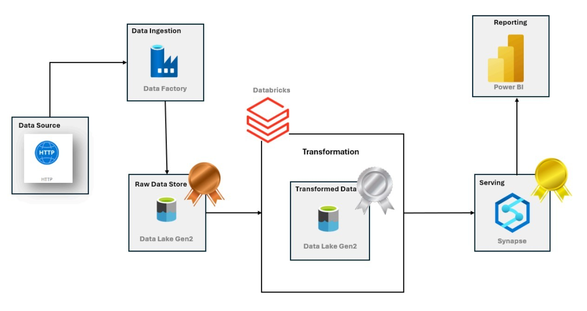
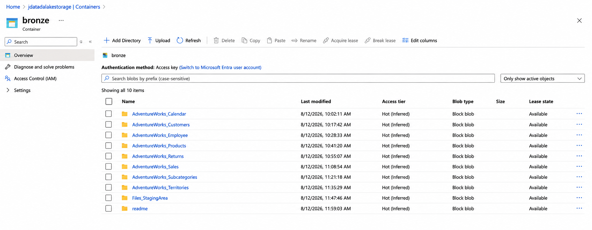
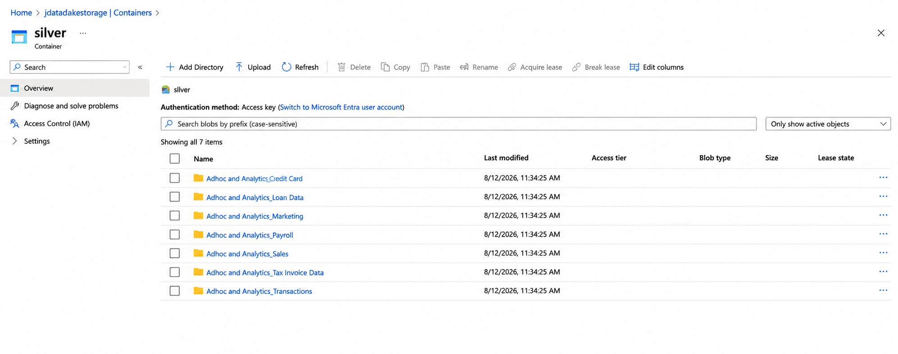
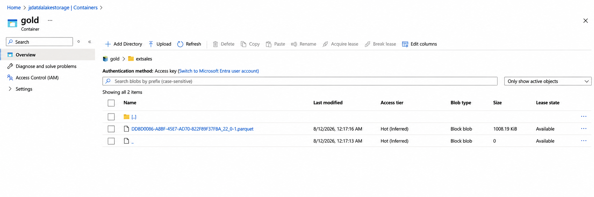
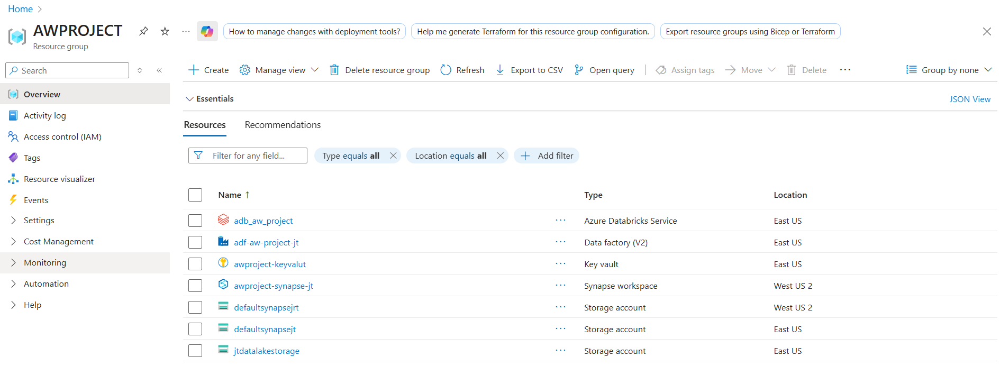
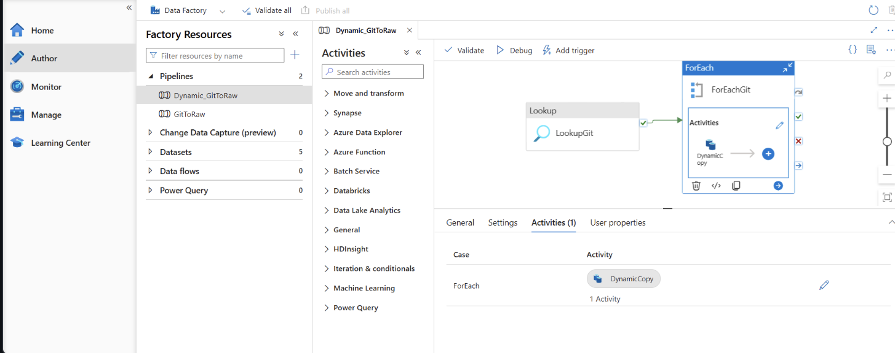

# Azure End-to-End Data Engineering Project 🚀

An end-to-end data engineering pipeline built using **Azure Data Factory, Azure Databricks, Azure Storage, Azure Synapse Analytics, and Power BI**.

The project uses the **AdventureWorks dataset** and follows a modern **Bronze → Silver → Gold** data architecture.

## 🏗️ Architecture

## 🔧 Azure Resources

* Azure Data Factory
* Azure Storage Account
* Azure Databricks
* Azure Synapse Analytics
* Power BI

## 🔄 Pipeline Flow

**Source → ADF → Bronze → Databricks → Silver → Synapse → Gold → Power BI**

### Bronze Layer

Raw data ingested from the source using **Azure Data Factory**.

### Silver Layer

Data cleaned and transformed using **Azure Databricks**.

### Gold Layer

Curated data prepared for analytics and BI reporting.

## 📸 Project Screenshots

## 🛠️ Tech Stack

**Azure Data Factory | Azure Databricks | Azure Storage | Azure Synapse Analytics | Power BI | GitHub**

## 🎯 Key Highlights

* End-to-end Azure data pipeline
* Automated data ingestion with ADF
* Bronze/Silver/Gold data architecture
* Data transformation using Databricks
* BI-ready data for reporting
* Scalable cloud-based architecture
